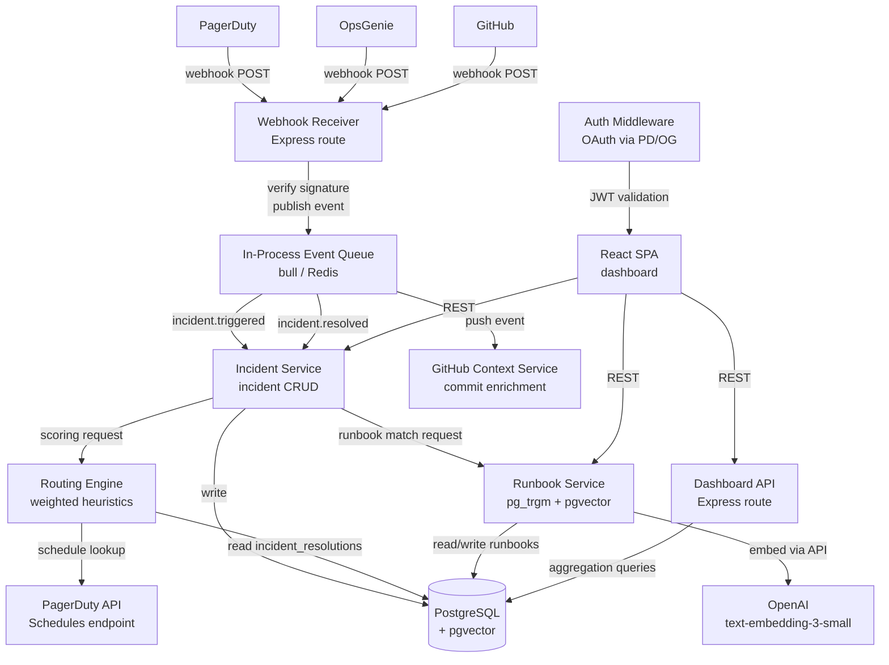

# Sentinel — Architecture Document
**Version**: 1.0
**Date**: 2026-05-12
**Author**: Tech Lead
**Status**: Approved for Implementation

---

## 1. System Overview

Sentinel is an on-call intelligence platform that ingests incident events from PagerDuty and OpsGenie, provides intelligent routing suggestions based on historical resolution patterns, captures and surfaces runbooks, and exposes team health analytics to engineering managers.

The MVP consists of five cooperating services within a single deployable Node.js monolith (modular monolith pattern — separate module directories with well-defined interfaces, extractable to microservices if scale requires).

---

## 2. High-Level Architecture Diagram



---

## 3. Component Descriptions

### 3.1 Webhook Receiver

**Responsibility**: Accept inbound HTTP POSTs from PagerDuty, OpsGenie, and GitHub. Validate HMAC signatures. Normalize payloads into a canonical internal event format. Publish to the event queue.

**Technology**: Express route at `/webhooks/:provider`

**Signature validation**:
- PagerDuty: `X-PagerDuty-Signature` header, HMAC-SHA256
- OpsGenie: `X-OG-Delivery-Time` + `X-OG-Signature` header, HMAC-SHA256
- GitHub: `X-Hub-Signature-256` header, HMAC-SHA256

**Normalization**: Each provider's payload is mapped to a canonical `InternalIncidentEvent`:

```typescript
interface InternalIncidentEvent {
  provider: 'pagerduty' | 'opsgenie';
  event_type: 'triggered' | 'acknowledged' | 'resolved' | 'escalated';
  incident_id: string;          // provider's native ID
  service_name: string;
  alert_type: string;           // normalized from provider alert key/alias
  severity: 'critical' | 'high' | 'medium' | 'low';
  triggered_at: string;         // ISO 8601
  raw_payload: Record<string, unknown>;
}
```

**Idempotency**: Receiver immediately writes a `webhook_events` log row with `(incident_id, event_type, provider_event_id)` unique constraint. Duplicate deliveries are silently acknowledged with 200 and not re-queued.

**Response**: Always returns HTTP 200 synchronously (within <100ms). Processing happens asynchronously in the queue. This satisfies PagerDuty's requirement to not retry on slow responses.

---

### 3.2 In-Process Event Queue

**Technology**: Bull (Redis-backed job queue) at MVP. Redis runs as a sidecar container.

**Queues**:
- `incident-events`: workers process `incident.triggered`, `incident.resolved`, etc.
- `embedding-jobs`: async embedding generation after runbook save (does not block the save response)

**Rationale for async queue**: PagerDuty can burst-deliver webhooks during a major incident (dozens of event updates per minute across many services). Synchronous processing in the webhook handler would risk timeouts and missed events. The queue provides back-pressure and retry capability.

**Tech lead pushback (addressed)**: The queue was added after identifying that synchronous webhook processing creates burst vulnerability. At low incident volumes the queue is invisible overhead; at high volumes it prevents dropped events.

---

### 3.3 Incident Service

**Responsibility**: Core CRUD for incidents. Orchestrates the routing suggestion call on `incident.triggered`. Handles runbook attachment on `incident.resolved`.

**Key operations**:
- On `incident.triggered`: create/upsert incident row, call Routing Engine, cache routing suggestion on incident row
- On `incident.resolved`: update incident row with `resolved_at`, mark `incident_resolutions` row
- `GET /incidents/:id/routing-suggestion`: returns cached routing suggestion (computed at trigger time)
- `POST /incidents/:id/runbook`: creates runbook and links to incident

---

### 3.4 Routing Engine

**Responsibility**: Given an incident, compute a ranked list of engineers with confidence scores.

**Scoring function**:

```
score(engineer, incident) =
  (0.4 × alert_type_match_score)
  + (0.3 × recency_score)
  + (0.3 × on_call_status_score)
```

**alert_type_match_score**: Fraction of the engineer's historical resolutions that match this exact `alert_type` on this exact `service_name`. Range 0.0–1.0. An engineer who has resolved `payments-svc/high_error_rate` 7 times out of 10 total resolutions scores 0.7.

**recency_score**: Exponential decay on days since last resolution of this alert type on this service.

```
recency_score = exp(-λ × days_since_last_resolution)
where λ = 0.05  (half-life ≈ 14 days)
```

If the engineer has never resolved this alert type, `recency_score = 0`.

**on_call_status_score**: Binary + boost.
- Currently primary on-call for the affected service: 1.0
- Currently secondary on-call: 0.6
- Not on-call: 0.0

**On-call status lookup**: Calls PagerDuty Schedules API (or OpsGenie On-Call API) in real-time at routing suggestion compute time. This adds one external API call per routing suggestion (~50–80ms) but eliminates the staleness risk of daily-synced schedules. Cache the response for 5 minutes per service to reduce API calls during incident storms.

**Output**:

```typescript
interface RoutingSuggestion {
  incident_id: string;
  computed_at: string;
  suggestions: Array<{
    engineer_id: string;
    engineer_name: string;
    score: number;           // 0.0–1.0
    confidence_pct: number;  // score normalized to top suggestion = 100%
    on_call_status: 'primary' | 'secondary' | 'not_on_call';
    resolution_count: number;
    last_resolved_at: string | null;
    score_breakdown: {
      alert_type_match: number;
      recency: number;
      on_call_status: number;
    };
  }>;
  routing_source: 'heuristic_v1';
}
```

**Event logging** (critical for future weight tuning): Every routing suggestion and its outcome (was the top suggestion accepted or overridden, and what was the final MTTR) is logged to `routing_events` table. This data feeds future empirical weight adjustment without requiring an ML model at launch.

---

### 3.5 Runbook Service

**Responsibility**: CRUD for runbooks. Similarity search for the incident response view and runbook capture modal. Embedding generation.

**Search strategy (two-tier)**:

*Tier 1 (MVP) — Keyword search via pg_trgm*: `pg_trgm` extension provides trigram-based similarity search on `title || ' ' || content`. Fast, no external dependency, good precision for exact or near-exact matches. GiST index on `tsvector(title, content)` for FTS.

*Tier 2 (v1.1) — Semantic search via pgvector*: After validating that keyword search misses relevant runbooks (measured by runbook recall in user sessions), add pgvector. Embeddings generated via `text-embedding-3-small` (OpenAI), 1536 dimensions. Stored in `runbooks.embedding` column. HNSW index (`ivfflat` at MVP scale).

**Rationale for deferring pgvector to v1.1**: Embeddings require committing to a model. `text-embedding-3-small` is cheap ($0.02/1M tokens) but changing models later requires re-embedding all runbooks. Validating that keyword search is insufficient before adding this complexity is the right engineering sequence.

**Runbook save flow**:
1. Validate and persist structured fields to `runbooks` table
2. Return 201 to client immediately
3. Enqueue embedding job to `embedding-jobs` queue
4. Worker picks up job, calls OpenAI embeddings API, updates `runbooks.embedding` column

---

### 3.6 GitHub Context Service

**Responsibility**: Enrich incidents with recent commits to the affected service's repository. Listens for `push` webhook events from GitHub and writes to `github_commits` table. On incident trigger, queries for commits to the service's repo in the last 24 hours.

**Mapping**: `services` table has a `github_repo` column for the mapping between service name and GitHub repo slug.

---

### 3.7 Dashboard API

**Responsibility**: Aggregation endpoints for the React dashboard. Primarily read-only, query-heavy.

**Key query — HDI calculation**:

```sql
WITH resolutions_in_period AS (
  SELECT
    engineer_id,
    COUNT(*) AS resolution_count
  FROM incident_resolutions ir
  JOIN incidents i ON i.id = ir.incident_id
  WHERE i.resolved_at BETWEEN $start AND $end
    AND i.team_id = $team_id
  GROUP BY engineer_id
),
team_total AS (
  SELECT SUM(resolution_count) AS total FROM resolutions_in_period
),
ranked AS (
  SELECT
    engineer_id,
    resolution_count,
    total,
    RANK() OVER (ORDER BY resolution_count DESC) AS rnk,
    COUNT(*) OVER () AS team_size
  FROM resolutions_in_period, team_total
)
SELECT
  engineer_id,
  resolution_count,
  ROUND(resolution_count::numeric / total * 100, 1) AS pct_of_total,
  -- HDI: % of total held by top ceil(team_size * 0.2) engineers
  CASE WHEN rnk <= CEIL(team_size * 0.2) THEN TRUE ELSE FALSE END AS is_hero
FROM ranked
ORDER BY resolution_count DESC;
```

**Performance**: Dashboard queries run against a read replica (or materialized views refreshed hourly) to avoid impacting the write path. At MVP scale (<50 teams, <10K incidents/month), direct queries against primary are acceptable.

---

### 3.8 React SPA

**Technology**: React 18, TypeScript, Vite, React Query (server state), Zustand (local UI state), Recharts (charts), Radix UI (accessible primitives).

**Auth flow**: OAuth via PagerDuty or OpsGenie identity provider. On first login, user is redirected to provider OAuth flow. On return, Sentinel backend exchanges code for provider access token, creates/updates engineer record, issues a signed JWT (HS256, 24h expiry). React app stores JWT in memory (not localStorage) to mitigate XSS.

---

## 4. Data Model

### 4.1 Entity Relationship

```
engineers ─────────────────────────────────────────────┐
     │                                                  │
     │ (many)                                           │ (many)
     ▼                                                  ▼
incident_resolutions ◄──────── incidents ──────► runbooks
     │                              │
     │                              │
     ▼                              ▼
 routing_events              github_commits
```

### 4.2 Table Definitions (see `15_backend.md` for full SQL)

**`engineers`**: `id`, `email`, `name`, `provider` (pagerduty/opsgenie), `provider_user_id`, `team_id`, `created_at`

**`incidents`**: `id` (UUID), `provider`, `provider_incident_id`, `service_name`, `alert_type`, `severity`, `status`, `triggered_at`, `resolved_at`, `team_id`, `routing_suggestion` (JSONB)

**`runbooks`**: `id` (UUID), `title`, `service_name`, `alert_type`, `content` (markdown text), `structured_data` (JSONB — steps, root_cause, prevention), `embedding` (vector(1536)), `created_by`, `updated_by`, `created_at`, `updated_at`

**`incident_resolutions`**: `id`, `incident_id` (FK), `engineer_id` (FK), `resolver_source` (manual/suggested/escalation), `routing_suggestion_accepted` (bool), `duration_seconds`, `runbook_id` (FK, nullable), `created_at`

**`rotation_schedules`**: `id`, `provider`, `provider_schedule_id`, `schedule_name`, `team_id`, `synced_at`. Note: used only for audit/history. Real-time on-call status fetched live from provider API.

**`routing_events`**: `id`, `incident_id`, `suggested_engineer_id`, `accepted` (bool), `override_engineer_id` (nullable), `final_mttr_seconds`, `created_at` — feed for empirical weight tuning.

**`github_commits`**: `id`, `repo_slug`, `sha`, `message`, `author_name`, `committed_at`, `created_at`

**`webhook_events`**: `id`, `provider`, `provider_event_id`, `incident_id`, `event_type`, `received_at` — idempotency log.

---

## 5. Non-Functional Requirements

| Requirement | Target | Approach |
|---|---|---|
| Routing suggestion latency (p99) | < 500ms | Routing is synchronous on incident trigger; result cached on incident row. `GET /routing-suggestion` serves cached result in < 10ms. Live on-call API call is the main latency driver — cached 5 min per service. |
| Runbook search latency (p99) | < 200ms | `pg_trgm` GiST index on runbook content. At < 100K runbooks, trigram search returns in < 50ms typically. |
| Webhook acknowledgment latency | < 100ms | Webhook handler is fire-and-queue, does no DB writes in the hot path beyond idempotency log. |
| Availability | 99.5% | Single-region deployment with managed Postgres (AWS RDS). No HA requirement at MVP. |
| Runbook library scale | < 100K runbooks | pgvector HNSW index performs well to this scale without sharding. |
| Concurrent incidents | < 500 simultaneous | Queue workers scale horizontally; DB connection pool (pg-pool) sized to 20 connections. |

---

## 6. Trade-Off Record

### 6.1 pgvector vs. Dedicated Vector DB (Pinecone, Weaviate)

**Chose pgvector.**

Pros: Single database, no new operational dependency, transactional consistency between runbook metadata and embeddings, sufficient for < 100K vectors at query speeds under 200ms with HNSW index.

Cons: Embedding search quality degrades at very large scale (> 1M vectors) and requires HNSW index tuning. Pinecone would offer better ANN performance at scale and managed embedding pipelines.

**Decision criteria**: At MVP we have near-zero runbooks. Operational simplicity wins. Revisit if runbook library exceeds 100K entries or if search latency SLO is breached.

### 6.2 Heuristic Routing vs. ML Model

**Chose heuristics.**

Pros: Explainable to engineers ("you're suggested because you resolved this 7× and are on-call"), no training data required at launch, deterministic, fast to iterate on weight changes.

Cons: Weights are manually chosen and may not be optimal. Does not learn from complex patterns (e.g., engineer A is best for payments-svc DB issues but engineer B is best for payments-svc network issues — same alert type, different expertise).

**Mitigation**: Log every suggestion + outcome from day 1 in `routing_events`. After 3–6 months of data, weights can be tuned empirically. Full ML routing is a v2 consideration, not blocked.

### 6.3 Webhook-First vs. Polling

**Chose webhooks.**

Pros: Real-time event delivery, no polling interval delay (critical for routing suggestion to appear fast), lower cost (no constant API calls).

Cons: Requires publicly reachable endpoint, signature validation is mandatory, provider retries can cause duplicates (handled by idempotency log).

**Decision criteria**: Polling PagerDuty API every 30 seconds would introduce 0–30s latency before Sentinel can surface a routing suggestion. For an incident tool, that latency is unacceptable.

### 6.4 Monolith vs. Microservices

**Chose modular monolith.**

Pros: Single deployment, shared database, no network hops between services, easier debugging, faster iteration.

Cons: Scaling individual components independently is harder. Shared DB means one bad query can affect all services.

**Decision criteria**: Team is 3–4 engineers. Microservices operational overhead (service mesh, distributed tracing, separate deployments) would dominate engineering time. Module boundaries are enforced in code; extraction is feasible at Series B scale.

---

## 7. Tech Lead Pushback Items

These are the two architectural risks that need resolution before sprint 1 begins:

### 7.1 Streaming Search as Runbook Library Grows

The `pg_trgm` full-text search returns all results before streaming any. At < 1K runbooks, this is invisible. At > 10K runbooks with complex queries, the user will see a latency spike before results render. Mitigation plan:

- Add query timing instrumentation from day 1 (`search_latency_ms` logged per query)
- Set alert threshold: if p95 search latency > 150ms, investigate
- Prepare for cursor-based pagination as the first mitigation step (already in the API contract)
- pgvector HNSW ANN search (when added in v1.1) returns approximate nearest neighbors in O(log n) — this is more streaming-friendly

### 7.2 Async Webhook Processing Queue for PagerDuty Bursts

During a major incident affecting many services, PagerDuty can fire dozens of webhook events within seconds. Scenario: a database cluster failover triggers 40 simultaneous `incident.triggered` events. Without a queue, each event would synchronously call the Routing Engine, which calls the PagerDuty Schedules API — resulting in 40 concurrent external API calls that likely hit PagerDuty's rate limit (the very system that is already having an incident).

**Mitigation already built in**: The Bull/Redis queue serializes event processing. Workers process one event at a time (configurable concurrency). The on-call status cache (5-minute TTL per service) further reduces Schedules API calls during bursts.

**Remaining risk**: Redis is a new operational dependency. If Redis is unavailable, webhook events cannot be queued and are dropped. At MVP, accept this risk with monitoring. If Redis uptime becomes a concern, consider falling back to synchronous processing with a DB-backed queue (using `pg_advisory_lock`).

---

## 8. Deployment Architecture (MVP)

```
                     ┌─────────────────────────────────┐
Internet             │  Load Balancer (ALB)             │
─────────────────►   │  TLS termination                 │
                     └──────────────┬──────────────────┘
                                    │
                     ┌──────────────▼──────────────────┐
                     │  EC2 / ECS Task                  │
                     │  Node.js Monolith                │
                     │  Port 3000                       │
                     └──────────────┬──────────────────┘
                                    │
              ┌─────────────────────┼─────────────────┐
              │                     │                  │
   ┌──────────▼──────┐   ┌──────────▼──────┐  ┌──────▼──────┐
   │  RDS PostgreSQL  │   │  ElastiCache     │  │  S3 (static │
   │  (pgvector ext)  │   │  Redis (queue)   │  │  React SPA) │
   └──────────────────┘   └─────────────────┘  └─────────────┘
```

**Infrastructure as Code**: Terraform. One environment at MVP (production). Staging added in sprint 3.

**CI/CD**: GitHub Actions. On merge to `main`: run tests, build Docker image, push to ECR, deploy to ECS via rolling update.

---

## 9. Security Considerations

- Webhook signatures validated before any payload processing — invalid signature returns 401 immediately
- All API endpoints require valid JWT; JWT validated via middleware before route handlers
- PagerDuty/OpsGenie API keys stored in AWS Secrets Manager, injected via environment variables at runtime
- OpenAI API key stored in Secrets Manager
- Runbook content is treated as potentially sensitive (incident details, system internals) — RBAC v1: all authenticated engineers on a team can read all team runbooks. Manager-only: HDI dashboard. Cross-team isolation enforced at query level via `team_id` filters.
- No PII in runbooks is enforced by policy, not technically at MVP (future: PII detection scan on runbook save)
